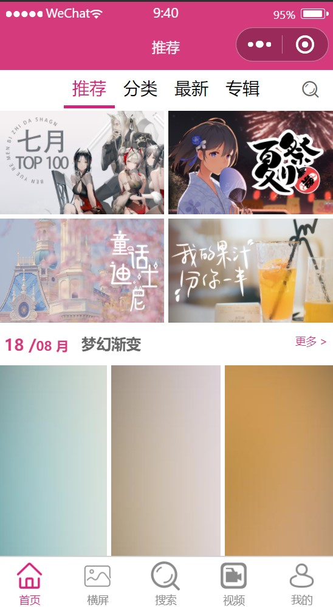
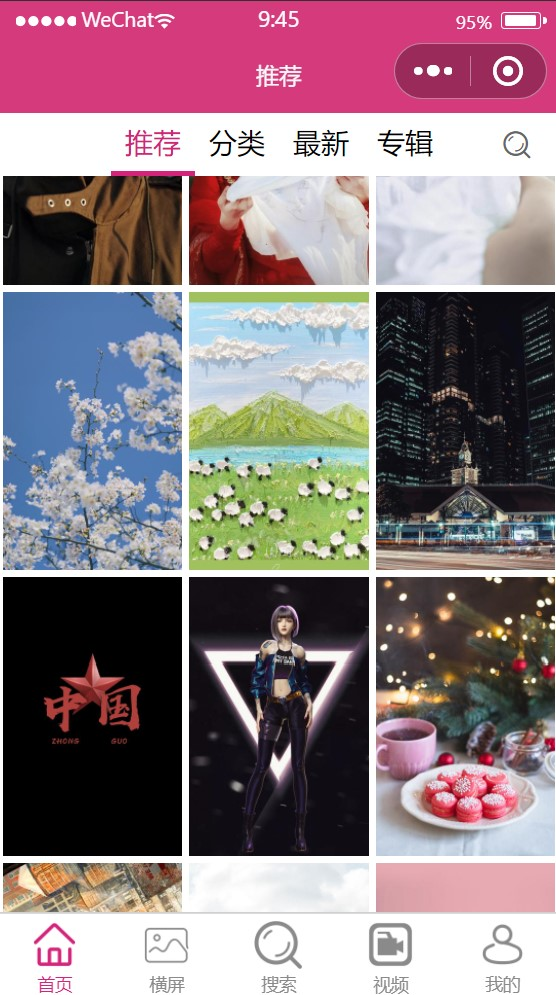
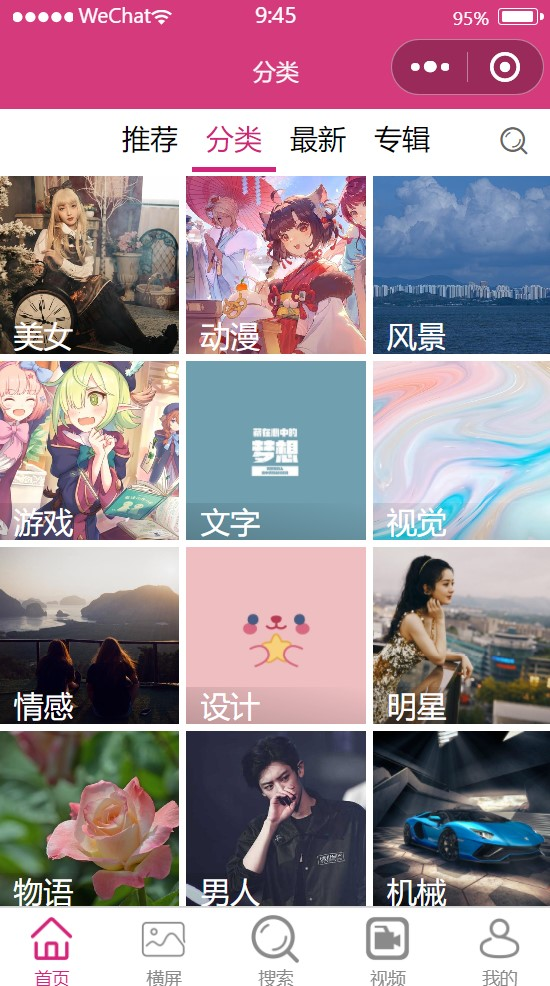
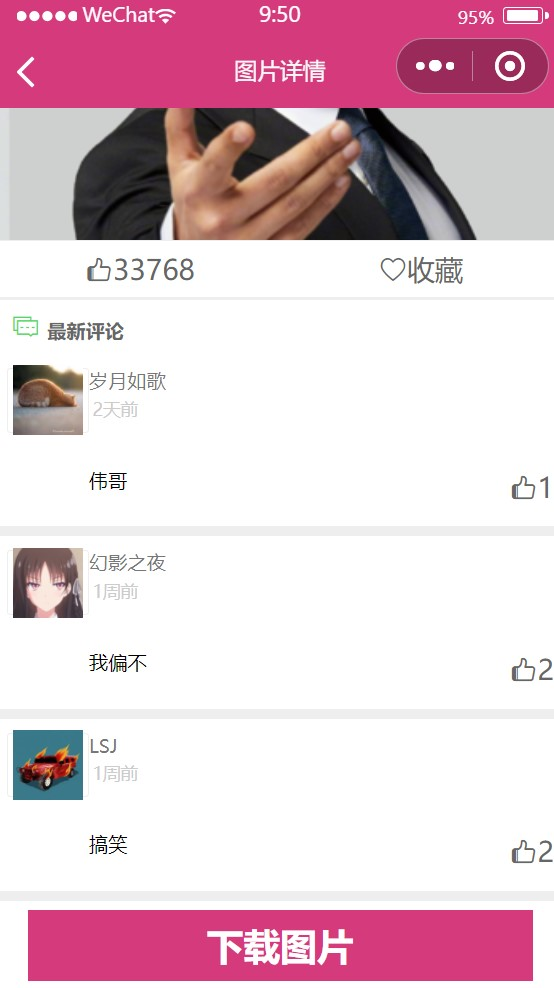
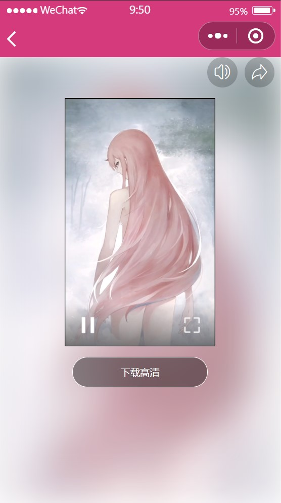
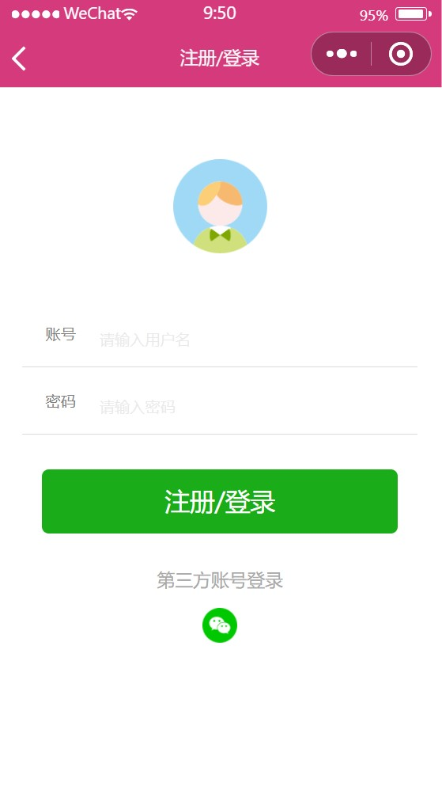

 :star:  :star:  :star:  :star:  :star: :star:  :star:  :star: 

# picture-search

#### 介绍
基于 uni-app 开发的微信小程序 图搜搜

#### 软件架构
基于 uni-app 项目默认模板进行扩展架构，其中使用到的组件有 uni-ui ，时间戳组件

#### 技术栈
Vue、ajax、sass、flex布局

#### 项目演示
- QQ交流：1976457550

##### 项目截图

#### 安装教程

1.  克隆代码到本地
2.  将代码拖拽至HBuilderX 编辑器中
3.  安装依赖插件 uni-ui 、SOtime.js

#### 使用说明

1.  完成安装配置之后即可启动调试器运行

#### 功能介绍

1. 项目首页提供了 图片 “推荐”、“分类”、“最新”、“专辑” 四个模块，分别展示了相应的图片，用户上滑页面会触发页面刷新，加载更多内容。
2. 所有图片均支持预览和下载，图片详情页面还显示了图片作者、评论、点赞数等信息。
3. 在图片详情页面“左滑”、“右滑”会相应加载“下一张”和“上一张”图片。所有图片均支持左右滑动。
4. 视屏页展示了“推荐”、“最新”、“热门”、“分类”等模块，各个模块展示相应内容。
5. 所有视屏均支持下载到本地，同时也支持在线观看、分享好友等功能。
6. 项目还支持搜索、横屏显示、登录等其他功能……

#### 参与贡献

感谢后端小伙伴的大力支持！！！

#### 说明

1. 由于使用的接口会不定时进行完善，可能最终AJAX请求返回的值有所变化，导致页面加载异常。
2. 项目中有一些接口可能会关闭使用，这可能会导致页面空白。
3. 后期我会不断完善项目。
